## Games

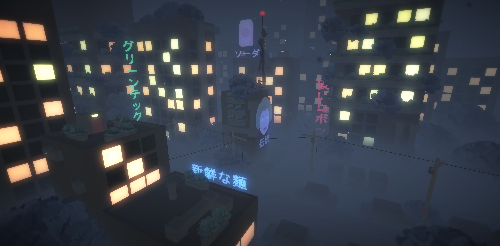
"JapUrb" Not really a game but more of an animated picture
[Play](https://gamejolt.com/games/MelonMan/238765)

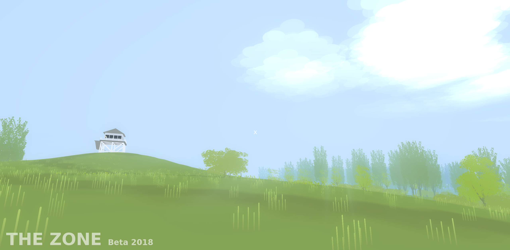
"TheZone" A minimalistic stylised survival experience
[Play](https://gamejolt.com/games/TheZone/35767)

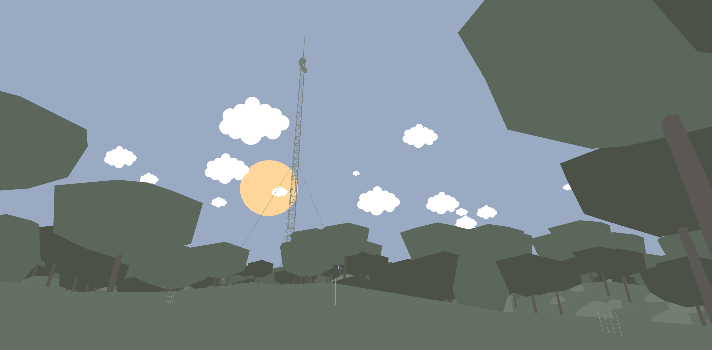
"ScapeLands" Take a walk in randomly generated, abstract worlds
[Play](https://gamejolt.com/games/ScapeLands/266635)

## 3D Work

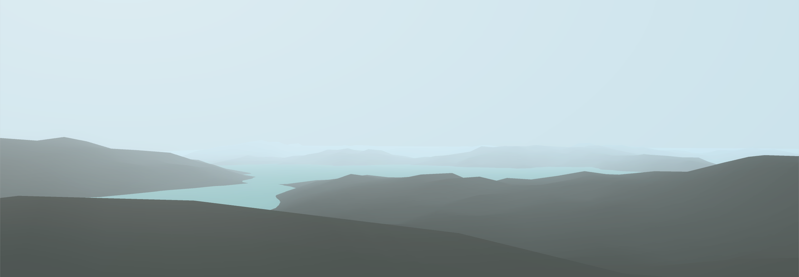
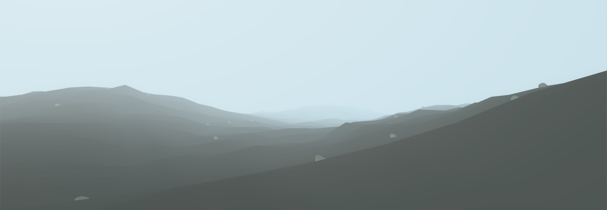
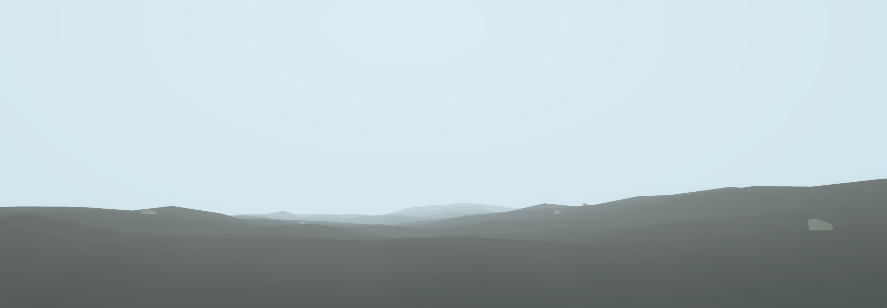
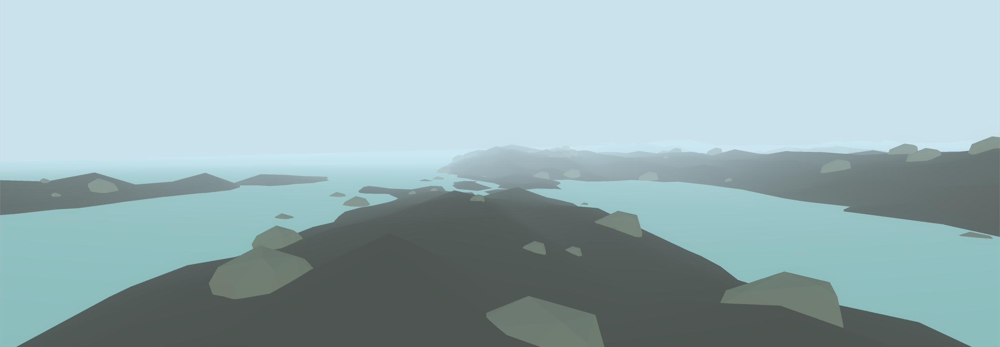
"Generating Landscapes" Randomly generated waste planet landscapes

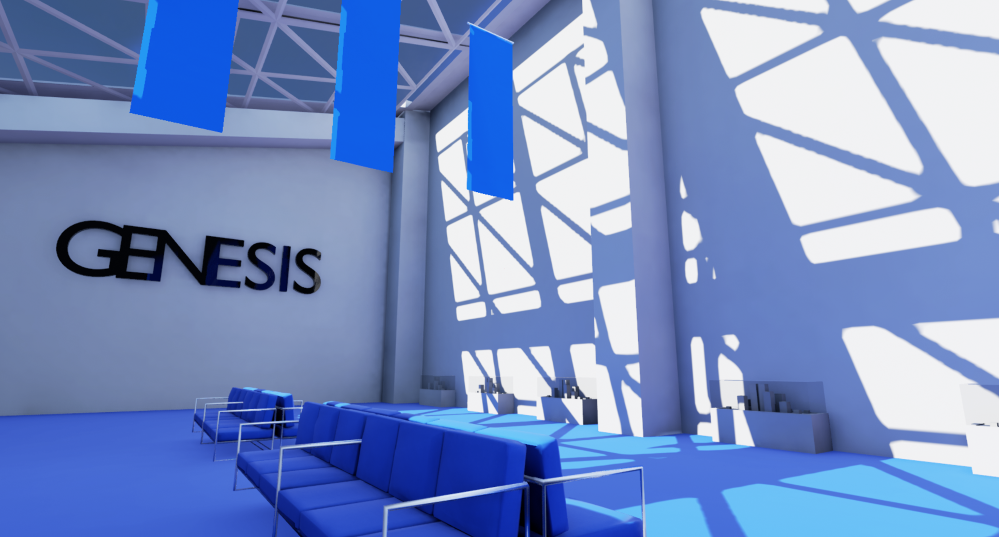
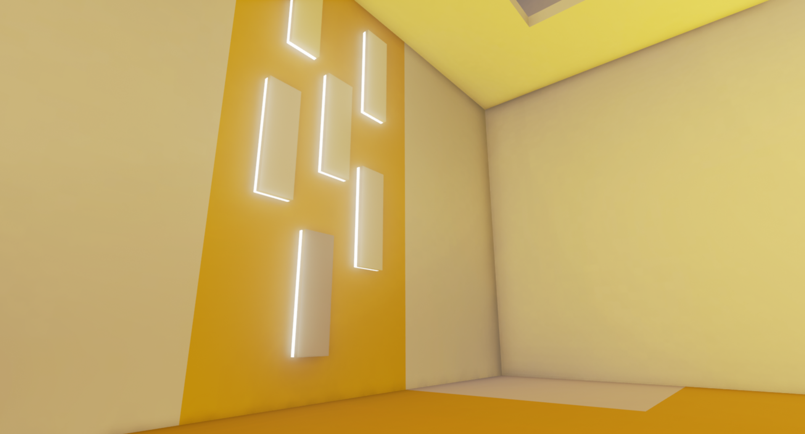
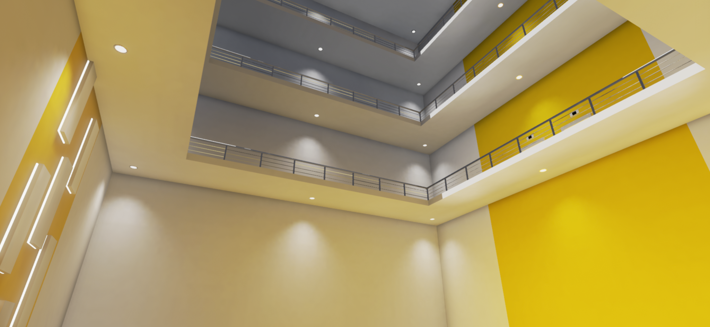
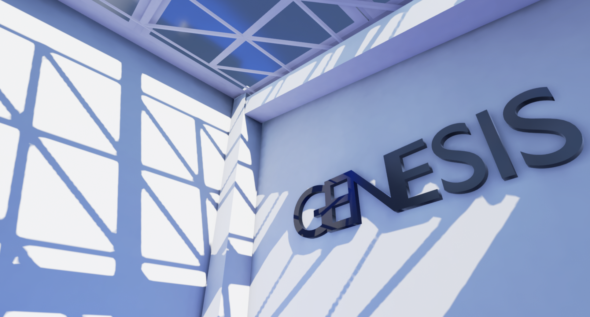
"Architectual experiments" Playin around with colors and shapes, lights and shadows

All shown content was created by Melongames / Felix Haffke 2017-19

[Facebook](https://www.facebook.com/Melon-Games-320701868112892/?ref=bookmarks) //
[GameJolt](https://gamejolt.com/@MelonMan) //
melonarts@gmx.de
